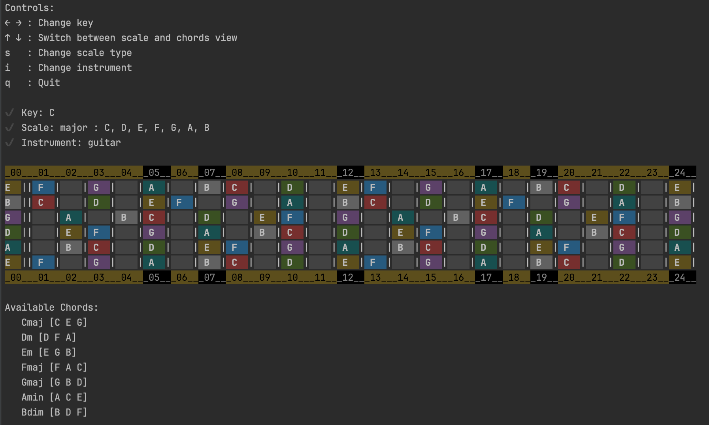

🎵 Scales



Scales is a hobby project created out of passion for both music theory and coding. The goal is to explore and deepen the understanding of musical scales while experimenting with algorithmic generation and visualization.

✨ What It Does

- Generates basic musical scales
- Visualizes scales on a guitar fretboard
- Supports Major, Minor, and Pentatonic scales

Example:

```
go run main.go -scale pentatonic -pentatonicType minor -key A -instrument guitar
```

[](https://pkg.go.dev/github.com/andriikushch/scales)

⚠️ Disclaimer
This project is a work in progress and may contain bugs or panics. While the generated data aims to be accurate, it’s recommended to validate it additionally before using it. Future updates may introduce changes to the API, focusing on enhancing functionality, improving stability, and addressing any identified issues.

Feedback and contributions are always welcome—let’s learn and create together! 🎶🚀

