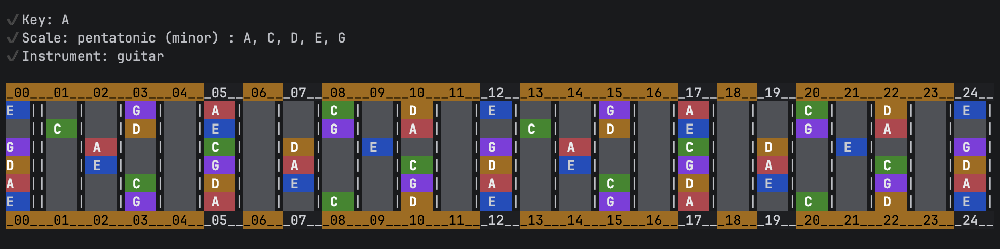

[](https://github.com/andriikushch/scales/actions/workflows/ci.yml) [](https://pkg.go.dev/github.com/andriikushch/scales)

🎵 Scales



Scales is a hobby project created out of passion for both music theory and coding. The goal is to explore and deepen the understanding of musical scales while experimenting with algorithmic generation and visualization.

✨ What It Does

- Generates musical scales, including alternate/folk names for many of them (e.g. `freygish`, `jazzMinor`, `manGong`)
- Visualizes scales on a guitar, bass, ukulele, or mandolin fretboard
- Parses chord notation (e.g. `Cmaj7`, `Dm7b5`) and renders chords on a fretboard too
- Exposes an MCP server (`get_scale`, `parse_chord`, `render_fretboard`) for use with MCP-compatible clients

Example:

```
go run main.go -scale minorPentatonic -key A -instrument guitar
```

🔌 MCP Server

```
go run ./internal/mcpserver
```

Starts an MCP server over stdio exposing `get_scale`, `parse_chord`, and `render_fretboard` for MCP-compatible clients.

🎼 Supported Scales

<!-- BEGIN GENERATED: scale-names (run `make generate-docs` to update) -->

**139 scale names** are available via `scales.ScaleNames()` / `scales.NewScaleByName`, the `-scale` flag, and the MCP `get_scale` tool — canonical scales and alternate/folk names alike (see `docs/scales.md` for structures and aliases):

`acoustic`, `adonaiMalakh`, `aeolian`, `aeolianDominant`, `aeolianFlat5`, `ahavaRabba`, `altered`, `alteredDoubleFlat7`, `alteredNatural5`, `andalusian`, `arabic`, `augmented`, `augmentedMajor`, `balinesePelog`, `bebopDominant`, `bebopDorian`, `bebopHarmonicMinor`, `bebopMajor`, `bebopMelodicMinor`, `blues`, `bluesMajorPentatonic`, `bluesMinorPentatonic`, `byzantine`, `chinese`, `chinesePentatonic`, `chromatic`, `dominantDiminished`, `dorian`, `dorianAeolianWithoutThe6th`, `dorianFlat2`, `dorianFlat5`, `dorianSharp4`, `doubleHarmonicMajor`, `doubleHarmonicMinor`, `enigmatic`, `freygish`, `gypsy`, `gypsyMajor`, `gypsyMinor`, `halfDiminished`, `halfWholeDiminished`, `harmonicMajor`, `harmonicMinor`, `hawaiian`, `hijaz`, `hindu`, `hungarianMajor`, `hungarianMinor`, `insen`, `ionian`, `ionianFlat6`, `ionianSharp2Sharp5`, `ionianSharp5`, `istrian`, `iwato`, `jazzMinor`, `korean`, `kumoi`, `leadingWholeTone`, `locrian`, `locrianDiminished`, `locrianDoubleFlat3DoubleFlat7`, `locrianDoubleFlat7`, `locrianNatural2`, `locrianNatural2Natural6`, `locrianNatural6`, `lydian`, `lydianAugmented`, `lydianAugmentedSharp2`, `lydianDiminished`, `lydianDominant`, `lydianFlat3`, `lydianFlat7`, `lydianSharp2`, `lydianSharp2Sharp6`, `major`, `majorBlues`, `majorHexatonic`, `majorLocrian`, `majorPentatonic`, `majorScaleWithoutThe7th`, `manGong`, `mayamalavagowla`, `melodicMinor`, `melodicMinorFlat2`, `melodicMinorSharp4`, `messiaenMode3`, `messiaenMode4`, `messiaenMode5`, `messiaenMode6`, `messiaenMode7`, `minorHexatonic`, `minorPentatonic`, `misheberak`, `mixolydian`, `mixolydianFlat2`, `mixolydianFlat6`, `mixolydianSharp4`, `miyakoBushi`, `mongolian`, `mysticChord`, `naturalMinor`, `neapolitanMajor`, `neapolitanMinor`, `oriental`, `overtone`, `persian`, `phrygian`, `phrygianDominant`, `phrygianFlat4`, `phrygianNatural6`, `prometheus`, `prometheusLiszt`, `prometheusNeapolitan`, `ragaBhairav`, `ragaBhupali`, `ragaDurga`, `ragaMalkauns`, `ritsu`, `ritsusen`, `romanianMinor`, `sakura`, `scaleOfHarmonics`, `slendro`, `spanishEightTone`, `spanishGypsy`, `superLocrian`, `superlocrianDoubleFlat7`, `suspendedPentatonic`, `thai`, `tritone`, `twoSemitoneTritone`, `ukrainianDorian`, `ultralocrian`, `ultraphrygian`, `verdisAscendingForm`, `wholeHalfDiminished`, `wholeTone`, `yo`

<!-- END GENERATED: scale-names -->

⚠️ Disclaimer
This project is a work in progress and may contain bugs or panics. While the generated data aims to be accurate, it’s recommended to validate it additionally before using it. Future updates may introduce changes to the API, focusing on enhancing functionality, improving stability, and addressing any identified issues.

Feedback and contributions are always welcome—let’s learn and create together! 🎶🚀
